<pre>
gabrlou@github:~$ whoami
Software engineering student at the Federal University of Goiás (UFG), Brazil.

gabrlou@github:~$ cat story.txt
I grew up far from the tech world and got in through pure curiosity. Now I
spend my days learning to make software that feels good to use. This is where
my experiments, bugs and notes land; the full journey is on
<a href="https://www.linkedin.com/in/gabrlou/">linkedin</a>.

gabrlou@github:~$ echo $STACK
python · golang · c | html · css | git · postgres

gabrlou@github:~$ cat links.txt
instagram  <a href="https://www.instagram.com/gabrlou/">gabrlou</a>
linkedin   <a href="https://www.linkedin.com/in/gabrlou/">in/gabrlou</a>
e-mail     <a href="mailto:gabriellourenco@inf.ufg.br">gabriellourenco@inf.ufg.br</a>
</pre>

<pre>
gabrlou@github:~$ cat README.notes
# every graphic here is generated, not embedded from anyone's server.
# ascii.svg is a photo pushed through a character ramp; the stat graphics
# are drawn by a scheduled action from the GitHub GraphQL API, once a day.
# they animate with SMIL because GitHub strips scripts from READMEs, and
# the typeface is JetBrains Mono, subset and inlined as base64.
#
# year.svg uses the portrait's character ramp: : + # @, quiet to loud.

# structure and technique inspired by @andriidrok1's profile
</pre>
